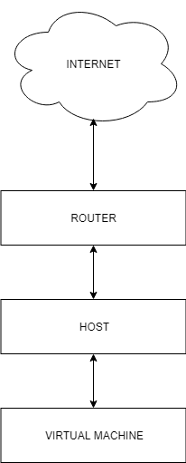

System operacyjny w środowisku sieciowym
=========================================

Charakterystyka systemu operacyjnego
------------------------------------

| Charakterystyka | wartość           | komentarzu |
| ------------- |:-------------:| -----:|
| nazwa      | linux | centos 7 |
| program (parametry sieci)      | nmcli device show |  |

Konfiguracja połączenia sieciowego
----------------------------------

| Parametr | wartość           | komentarzu |
| ------------- |:-------------:| -----:|
| Adres IP      |10.0.2.15 | przydzielony przez DHCP |
| Maska podsieci      | /24 |  |
| Brama      | 10.0.2.2 |  |
| DNS 1      | 10.10.0.8 |  |
| DNS 2      | 10.10.0.4 |  |

Schemat sieci
-------------

