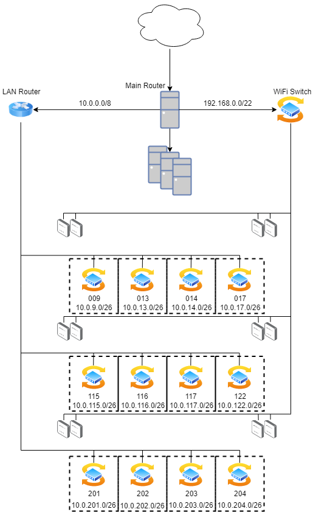

# Rozwiązanie
## WiFi

siec wifi ma pomiescic 800 hostow wiec potrzebujemy maski /22 (conajmniej, ja bym dał wiecej hostów na wszelki wypadek)

`192.168.0.0/22`

## LAN
dla adresów LANowych weźmiemy sieć prywatną 

`10.0.0.0/8`

aby można było użyć mnemonicznych adresów sieci dla laboratoriów np:

`10.0.9.0/26` dla sali 009

maska /26 zapewnia nam 62 adresy hostów na każdą salę.

## SALE
### Parter
---
009 - `10.0.9.0/26`

013 - `10.0.13.0/26`

014 - `10.0.14.0/26`

017 - `10.0.17.0/26`
### Piętro 1
---
115 - `10.0.115.0/26`

116 - `10.0.116.0/26`

117 - `10.0.117.0/26`

122 - `10.0.122.0/26`
### Piętro 2
---
201 - `10.0.201.0/26`

202 - `10.0.202.0/26`

203 - `10.0.203.0/26`

204 - `10.0.204.0/26`

## Schemat
