# Rozwiązanie
## WiFi

siec wifi ma pomiescic 800 hostow wiec potrzebujemy maski /22

`192.168.0.0/22`

## LAN
dla adresów LANowych weźmiemy sieć prywatną 

`10.0.0.0/8`

aby można było użyć odpowiadających adresów sieci dla laboratoriów np:

`10.0.9.0/26` dla sali 009

maska /26 zapewnia nam 62 adresy hostów na każdą salę.

## SALE
### Parter
---
009 - `10.0.9.0/26`

013 - `10.0.13.0/26`

014 - `10.0.14.0/26`

017 - `10.0.17.0/26`
### Piętro 1
---
115 - `10.0.115.0/26`

116 - `10.0.116.0/26`

117 - `10.0.117.0/26`

122 - `10.0.122.0/26`
### Piętro 2
---
201 - `10.0.201.0/26`

202 - `10.0.202.0/26`

203 - `10.0.203.0/26`

204 - `10.0.204.0/26`

## Diagram

### Diagram w programie GNS3
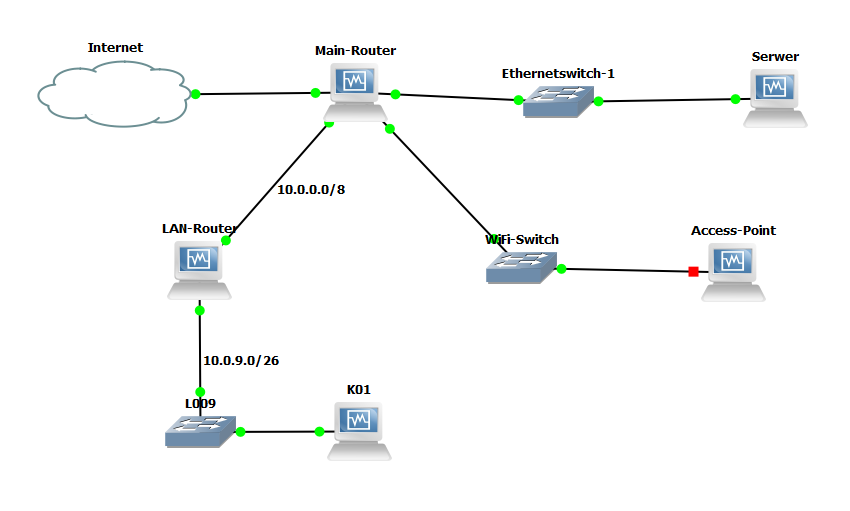

## Konfiguracja
* Wszystkie routery mają ustawiony ip forwarding w pliku `/etc/sysctl.conf`

* Ustawianie ip na interfejs `ip a add {ip} dev {interfejs}`
* Ustawianie maskarady `iptables -t nat -A POSTROUTING -s {ip obslugiwanej sieci} -o {interfejs wyjsciowy} -j MASQUERADE`
* Ustawianie routingu default `ip route add default via {ip}`

### Main Router
#### Interfejsy
polecenie `ip a`

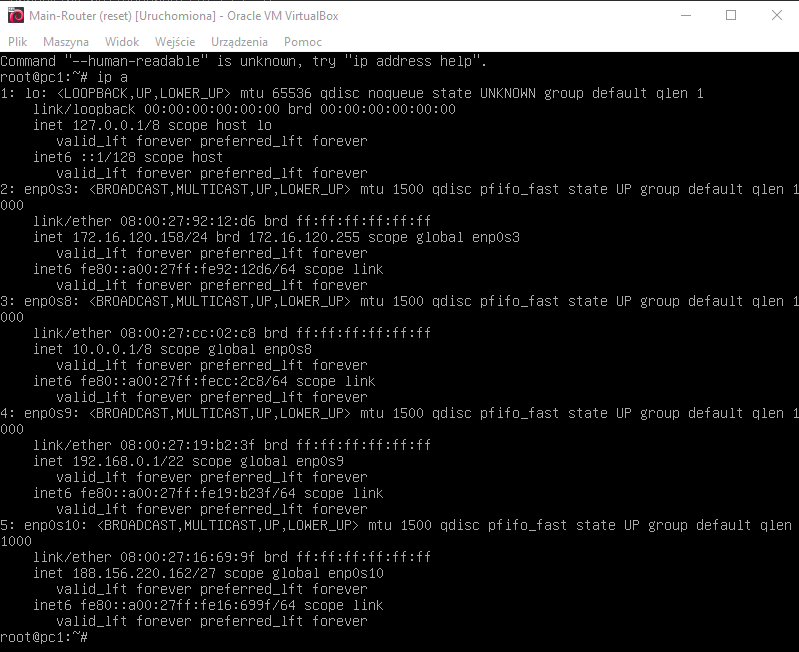

#### Routing
polecenie `ip route`

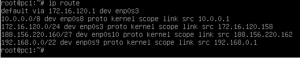
#### Maskarady
polecenie `iptables -t nat -L`

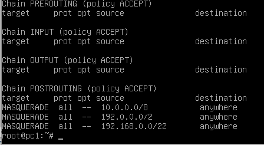
#### Serwer DHCP dla sieci LAN
polecenia 

`apt-get install isc-dhcp-server`

`systemctl start isc-dhcp-server`

pliki 

`/etc/default/isc-dhcp-server`

`/etc/dhcp/dhcpd.conf`

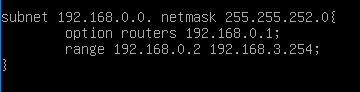

### LAN router
#### Interfejsy
polecenie `ip a`

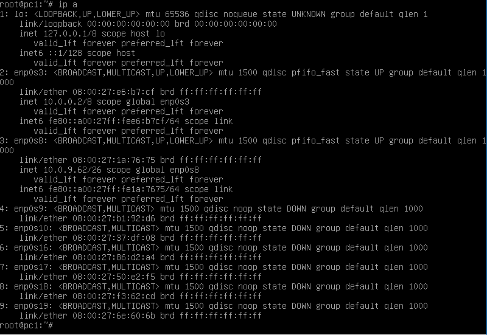

#### Routing
polecenie `ip route`

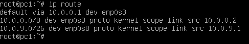
#### Maskarady
polecenie `iptables -t nat -L`

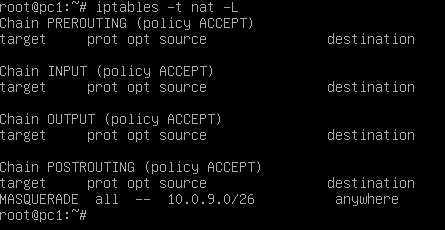

### K01
#### Interfejsy
polecenie `ip a`

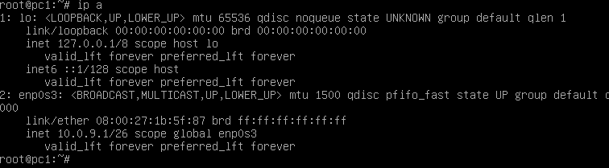

#### Routing
polecenie `ip route`

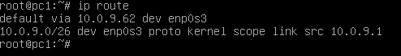
#### Statyczny ip na interfejs
plik `/etc/network/interfaces`

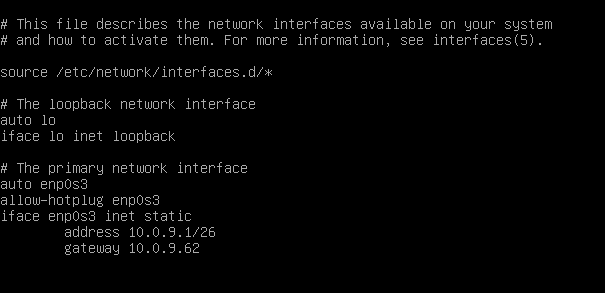