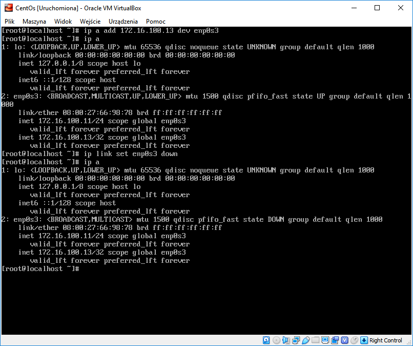
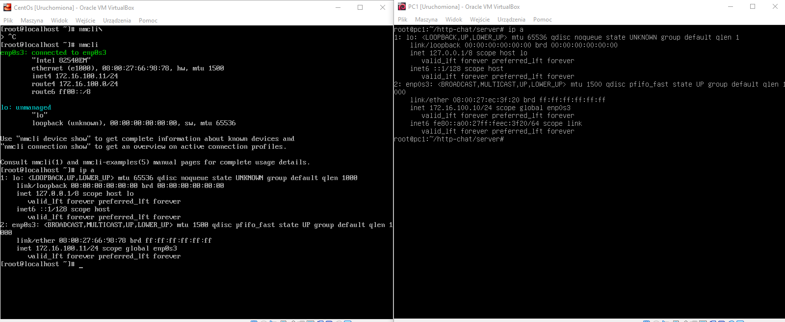
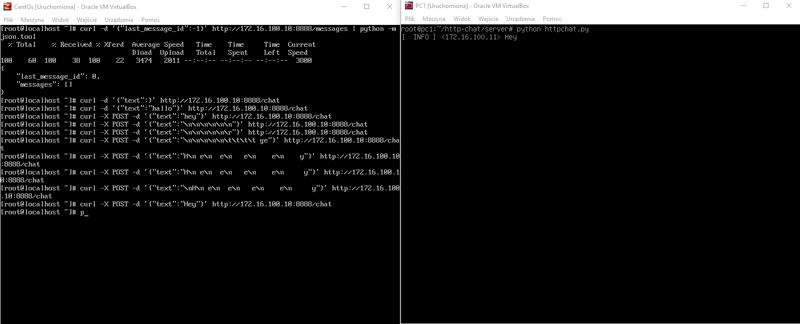

1. Konfiguracja sieci
    * Dodawanie statycznego ip do interfejsu

    * Wyświetlanie konfiguracji interfejsów na obu maszynach 

2 Serwer
    * Testowanie komunikacji pomiędzy serwerem i klientem
