# Wykonane kroki

## 1 Obliczenie podsieci

Mając za punkt startowy adres ```172.22.128.0/17``` zadaniem było wydzielić podsieci ```LAN1``` oraz ```LAN2``` tak aby mogły one pomieścić odpowiednio 500 oraz 5000 hostów.

Podział rozpocząłem od wyznaczenia większej podsieci. Wykorzystując stronę  http://jodies.de/ipcalc

W pierwszej kolejności wyliczyłem podsieć ```LAN2``` 


### 1.1 Sposób wyliczenia maski:

#### 1.1.1 5000 hostów
Standardowa maska /24 daje nam 2^8 = 256 hostów w tym adres sieci oraz broadcast. Aby uzyskac odpowiednią wielkość sieci zmieniamy maskę na /19 (32-19 = 13 -> 2^13 = 8192) w ten sposób otrzymujemy sieć ```172.22.128.0/19``` z adresem broadcast ```172.22.159.255``` 
[link](http://jodies.de/ipcalc?host=172.22.128.0&mask1=17&mask2=19)
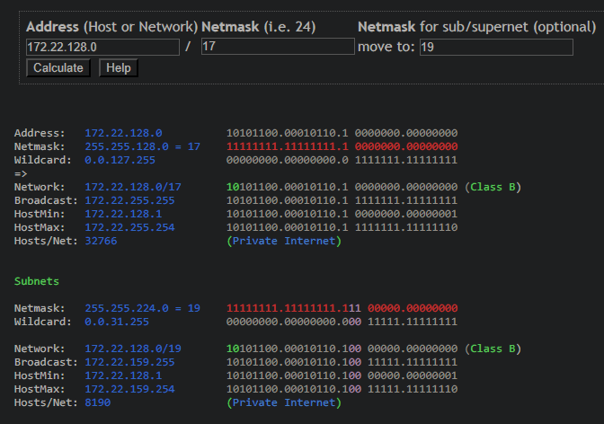

#### 1.1.2 500 hostów
Podobnie jak przy poprzednim punkcie, standardowa maska nie bedzie w stanie pomieścić wszystkich hostów. Rozpoczynając od ```172.22.160.0``` (adres o 1 wiekszy od adresu broadcast sieci ``LAN2``). Tym razem wystarczy maska /23 (32 - 23 = 9 ; 2^9 = 512). Otrzymujemy sieć `172.22.160.0/23` z adresem broadcast `172.22.161.255` [link](http://jodies.de/ipcalc?host=172.22.160.0&mask1=19&mask2=23)
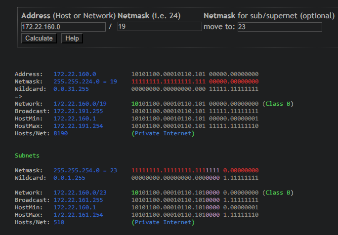

---
## 2 Konfiguracja sieci w VirtualBox

### 2.1 LAN1
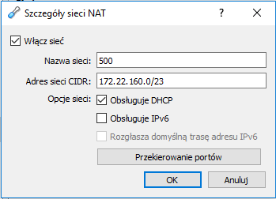

### 2.2 LAN2


---
## 3 Konfiguracja PC0
### 3.1 Połączenie z internetem
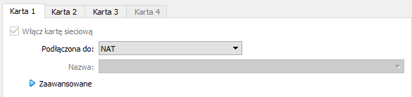
### 3.2 Połączenie z LAN1
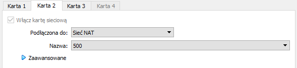
### 3.3 Połączenie z LAN2
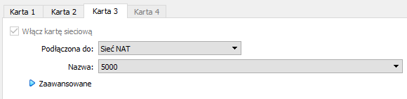
### 3.4 ip a
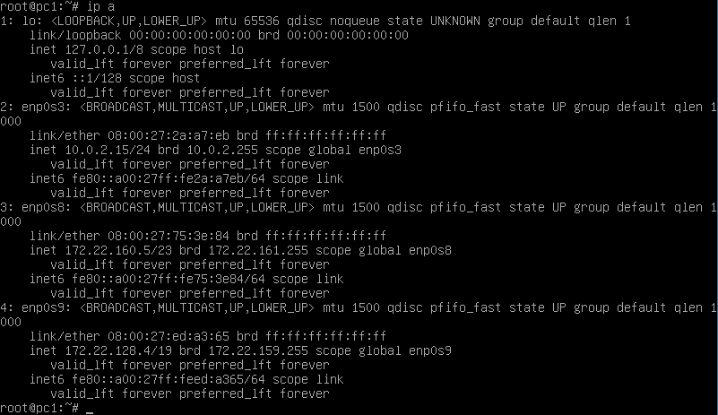

### 3.5 IP Forwarding
plik `/etc/sysctl.conf`

konfiguracja net.ipv4.ip_forward
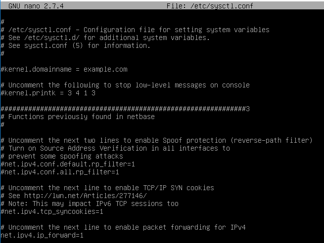

### 3.6 Routing
---
## 4 Konfiguracja PC1
### 4.1 Połączenie z LAN1
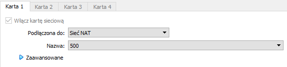
### 4.2 ip a
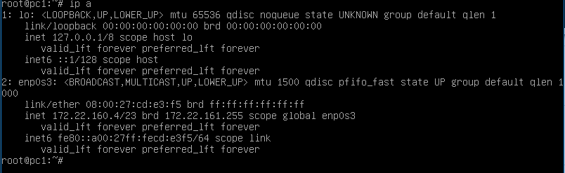
### 4.3 Routing
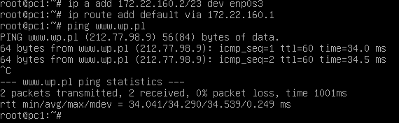

---
## 5 Konfiguracja PC2
### 5.1 Połączenie z LAN2
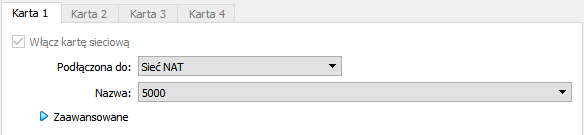
### 5.2 ip a
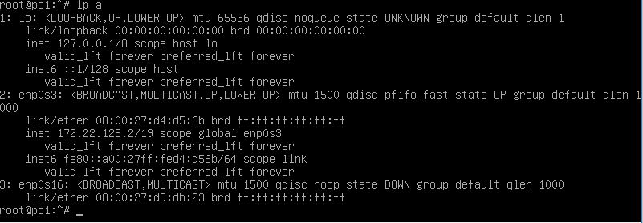
### 5.3 Routing
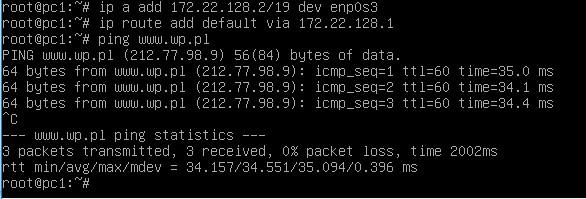
